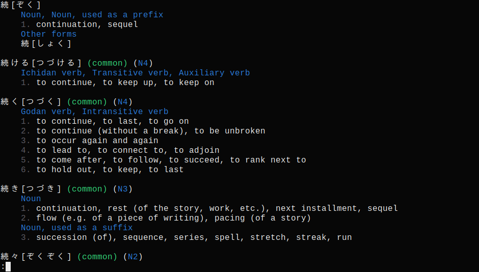
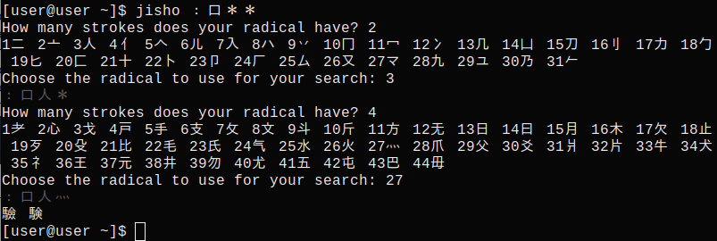

# Jisho (cli)
A very simple cli tool to look up Japanese words using jisho.org's API.
Searching for kanji by radicals is also available.

<br>



# Installation
Binaries are directly available from the release tab.

# Compilation

Download source and run
```
cargo build --release
```

# Usage
```
jisho [<words to look up>]
jisho :[<radicals in kanji>]
```
When looking up radicals, * (or ＊) can be used to add a radical that can't be easily typed, e.g. 气.

# Note
To search kanji by radicals, the [radkfile](https://www.edrdg.org/krad/kradinf.html) needs to be installed in either `~/.local/share/` on Linux or `~\AppData\Local\` on Windows.
