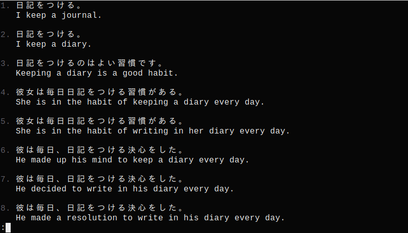

# Jisho (cli)
A simple cli tool to look up Japanese words using jisho.org's API.
Additionally, searching for kanji by radicals and browsing tatoeba's database of example sentences is also available.

### Jisho dictionary 


### Searching by radicals


### Tatoeba sentences


## Installation
Binaries are directly available from the release tab.

## Compilation

Download source and run
```
cargo build --release
```

## Usage
A readline wrapper like `rlwrap` is strongly recommended if using `jisho-cli` interactively (-i or empty input).
```
jisho [<words to look up>]
jisho :[<radicals in kanji>]
jisho _[<expressions in  sentences>]
```
When looking up kanji, * (or ＊) can be used to add a radical that can't be easily typed, e.g. 气.

## Note
To search kanji by radicals, the [radkfile](https://www.edrdg.org/krad/kradinf.html) needs to be installed in either `~/.local/share/` on Linux or `~\AppData\Local\ `on Windows.

Example sentences taken from [tatoeba](https://tatoeba.org/).
